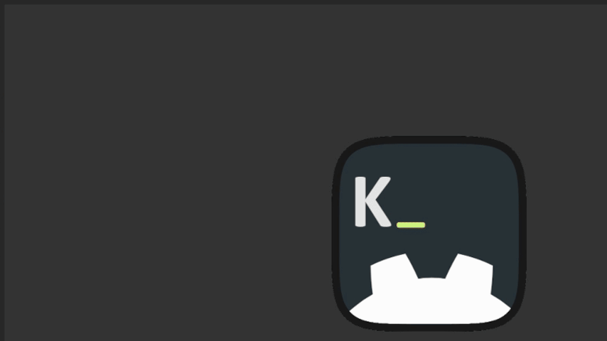

# GDKonsole
 
A simple Quake-style developer console for Godot 4. Drop it into any project to get an in-game terminal for debugging, running commands, and building developer tools — without touching your game logic.
 

 
---
 
## Features
 
- Lightweight — no dependencies, pure GDScript
- Print messages, allow code execution directly from the console
- Register custom commands with typed arguments, and default values
- Register CVars — named runtime variables you can read and set from the console
- Autocomplete based on registered commands.
- Error handling, and Godot debugger redirection
- Commands history
---
 
## Installation
 
1. Clone repository or Download the lastest release
2. Copy the `addons/gdkonsole/` folder into your project's `addons/` directory.
3. Enable the plugin in **Project → Project Settings → Plugins**.
4. GDKonsole will register itself as an autoload — no scene setup required.
5. Set the desired toggle key in Actions

__NOTE: Plugin injects an action called "gdkonsole_toggle" when enabled. Sometimes, it requires to restart Godot to appear. (or reload project)__

---
 
## Usage
 
### Opening the console
 
Press the toggle key (not bound by default) during runtime to open or close the console.
 
### Writing to the console
 
```gdscript
GDKonsole.write("Hello, world!");
GDKonsole.write_line("This gets its own line.");
GDKonsole.write_line("[color=green]Let's touch some grass![/color]"); # Console uses Godot RichTextLabel BBCode
```
 
### Registering commands
 
Commands map a string to an object and method name.

The most basic command creation will be

```gdscript
GDKonsole.add_command("test", self, "test_something");
```
 
You can add descriptions to your commands

```gdscript
GDKonsole.add_command("kill_anything", actor_manager, "kill_any") \
    .set_description("Randomly kills an actor in scene");
```

Add arguments, that can be of any type supported by `Variant.Type` Godot enum.
Internally, GDKonsole uses Godot `str_to_var` to convert types.

```gdscript
GDKonsole.add_command("kill_player", actor_manager, "kill_player") \
    .add_argument("player_id", TYPE_INT) \
    .set_description("Kill player identified by player_id");
```

Bools will be parsed from ints (0=false, any other value=true) or true/false strings.

The third parameter of "add_argument" sets default value

```gdscript
GDKonsole.add_command("enable_cheats", game_manager, "enable_cheats") \
    .add_argument("enable", TYPE_BOOL, false) \
    .set_description("Allow use of cheats");
```

Commands are called when the user types their name and presses Enter.
 
### Registering CVars

CVars (Console Variables) are named variables bound to properties on your objects.

Bind any property on any object:
```gdscript
GDKonsole.add_cvar("sv_gravity", physics_manager, "gravity") \
    .set_description("World gravity value");
```

To read a CVar value, just type it, and autocomplete will show the current value.
NOTE: autocomplete shown value is captured at time of writing, and not kept up to date.

To set a CVar value, enter it, and give the value like so:
```GDKonsole
sv_gravity 500.0
```

### Builtins

help - Prints all commands and their usage.
exec - Run all commands from file at given path.

---
 
## Requirements
 
- Godot **4.x**
---
 
## Contributing
 
Contributions are welcome! Feel free to open an issue or submit a pull request.
 
1. Fork the repository
2. Create a branch: `git checkout -b feature/my-feature`
3. Commit your changes: `git commit -m 'Add my feature'`
4. Push: `git push origin feature/my-feature`
5. Open a Pull Request
Please keep PRs focused — one feature or fix per PR makes review easier.
 
---
 
## License
 
This project is licensed under the [MIT License](LICENSE).